# Changelog

Every update to Jangan, newest first. This is the same text and pictures the game shows in its **What's new**
window (press **J** in game). It is generated from `content/changelog/` by `pnpm changelog`; edit the entries there.

- [October 6 (night): Winter fun is ready — cold, snowball fights, gift boxes and a new boss](#october-6-night-winter-fun-is-ready--cold-snowball-fights-gift-boxes-and-a-new-boss)
- [October 6: Winter is coming to Jangan, and the tornado got fierce](#october-6-winter-is-coming-to-jangan-and-the-tornado-got-fierce)
- [October 6: No more stuck black screens](#october-6-no-more-stuck-black-screens)
- [October 5 (evening): Storms, lightning, a tornado and a new Berserk](#october-5-evening-storms-lightning-a-tornado-and-a-new-berserk)
- [October 5: Play the Boss, the black-screen fix and more](#october-5-play-the-boss-the-black-screen-fix-and-more)

---

## October 6 (night): Winter fun is ready — cold, snowball fights, gift boxes and a new boss

*October 6, 2026*

**When the snow season starts on December 1, winter is more than a look: the cold bites outdoors, you can throw snowballs at your friends, monsters drop holiday gift boxes, and snow spirits and the Ice Yeti come down from the hills. Deep snow now buries the grass too.**

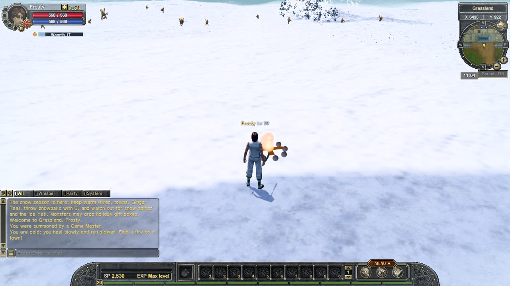

## Keep warm

During the snow season a **Warmth** bar appears under your HP and MP when you're outdoors.

- Your warmth **drops outside**, faster at **night**, in **snowfall** and much faster in a **blizzard**.
- **Towns and fires warm you up**: campfires in the fields, braziers, gate fires and lanterns.
- When you get cold you heal more slowly and walk a little slower. The cold never kills you by itself, but don't push your luck.
- **Ginger Tea** from the potion merchant (a Winter tab in season) warms you right up and keeps the cold away for a few minutes.

## Snowball fights!

Press **B** to scoop up snow and throw a snowball at your target (or straight ahead). You need some snow on the ground.

- A hit does **no damage** to players: just a **Splat!**, a white splash on their screen and a short slowdown.
- Hit a monster and it turns on you.
- **Shift+B** shows the snowball scoreboard: who landed the most hits this winter?

## Winter monsters and a new boss

- **Snow sprites and snow spirits** appear in the snowy fields during the season.
- The **Ice Yeti**, a huge new world boss, makes its lair in the north-western hills. Its arrival is announced to everyone. Watch for its ground slam, frost breath and snowball barrage, and the snow spirits it calls when it's hurt.

## Holiday gift boxes

During the season, any monster can drop a **gift box** (the Ice Yeti drops several). **Right-click** it to open: two goodies like potions, Ginger Tea, gold or Lucky Powder, and a small chance of something rare.

## Deep snow buries the grass

As the snow gets deeper, the grass sinks into it, and under deep snow it disappears completely.

---

## October 6: Winter is coming to Jangan, and the tornado got fierce

*October 6, 2026*

**From December 1 to January 15 the whole region turns white: snow on the town, the trees and the fields, frozen ponds, snowfall and blizzards. And the lightning tornado is now a dark, roaring monster that throws you much further and can finish you off if you're already hurt.**

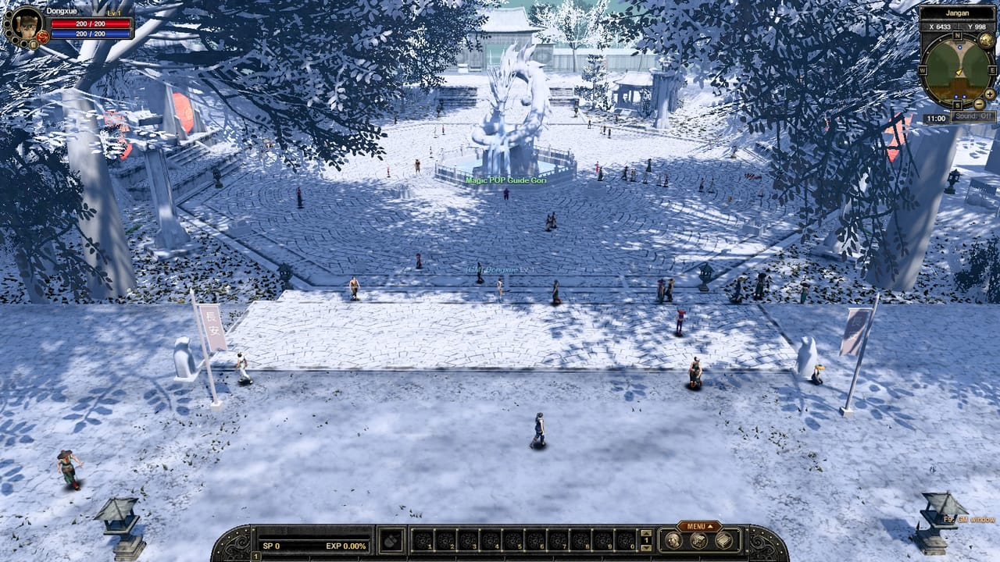

## Winter in Jangan: December 1 – January 15

On **December 1** the snow season begins and lasts until **January 15**. The first snowfall eases in: the snow **builds up while it snows** (a light dusting after half an hour, deep snow after a few hours) and **melts slowly** on sunny days.

- **Snow everywhere**: the town's roofs, walls, stairs and plaza, every tree, and the fields.
- **Frosted grass**: shorter and pale, with no flowers.
- **Frozen ponds** with cracks and drifted snow, and a **frozen fountain**. The sea stays open.
- **Footprints** in the snow behind every player, monster and townsperson.
- **Your breath** shows in the cold air.
- **Crunchy footsteps** in the snow, quiet snowy days, and birds that go silent while it snows.

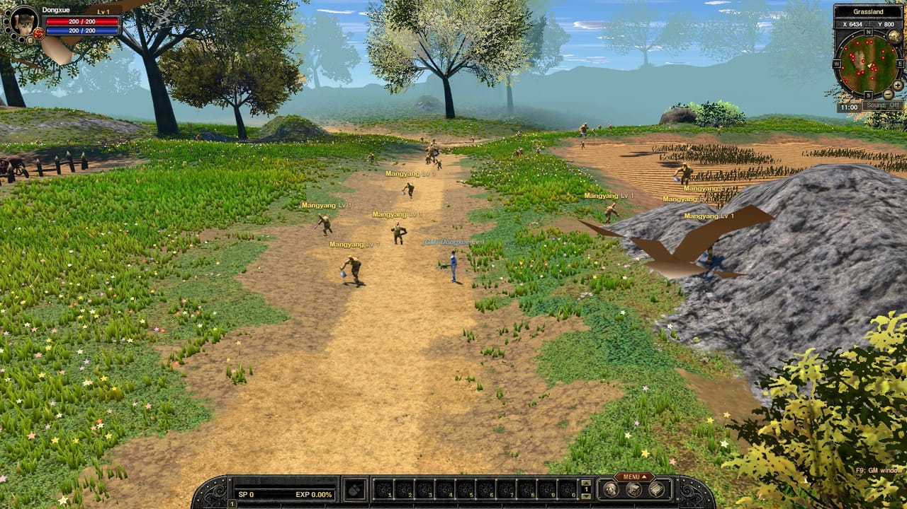
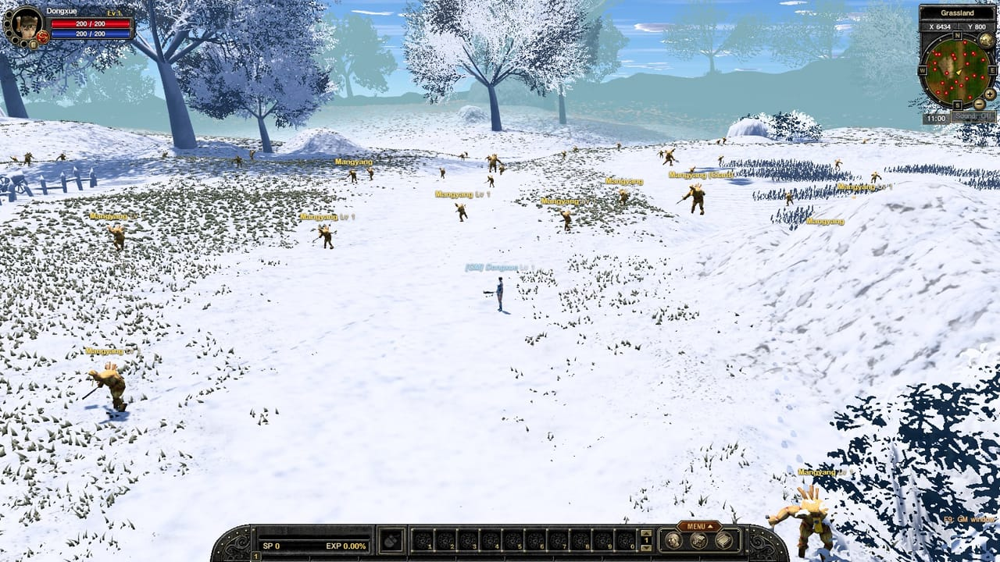

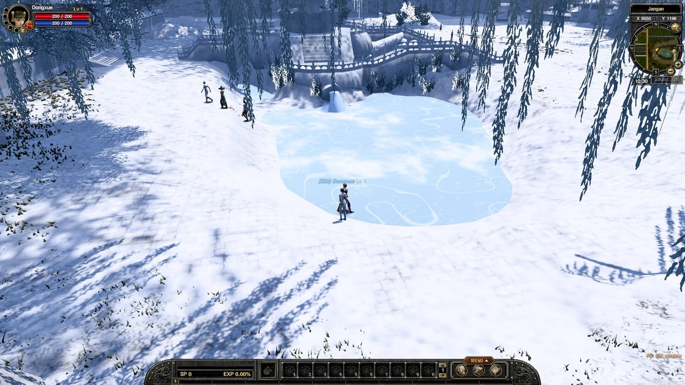
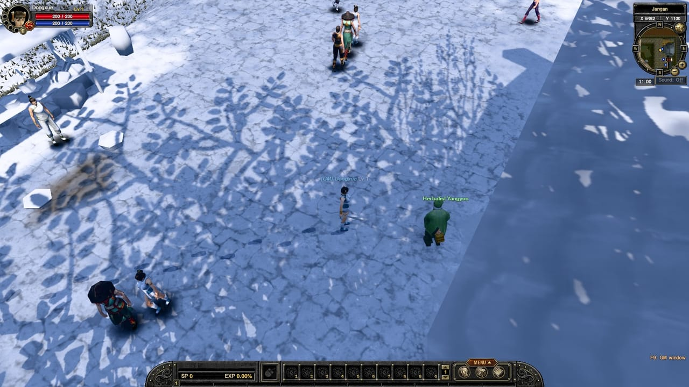

### Snowfall and blizzards

During the season, **rain falls as snow**, and storms become **blizzards**: thick white fog, snow driven sideways by a howling wind, and snowdrifts that slow you down outside town. All the storm effects you know still apply in a blizzard (monsters see less, undead grow stronger, storm-charged monsters...), and lightning is rare in winter.

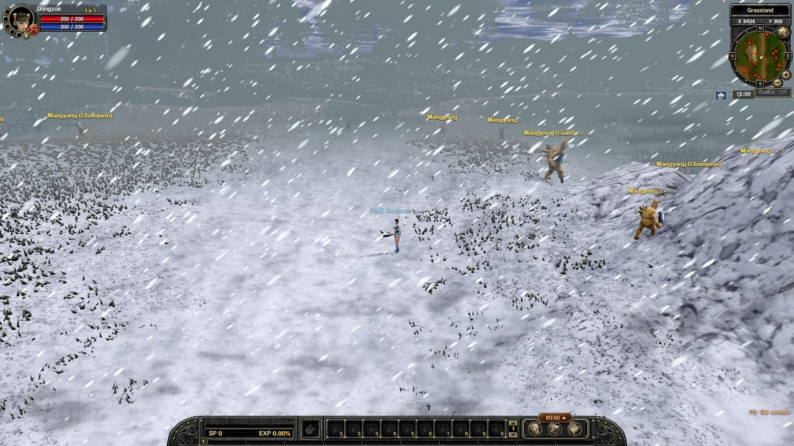

> More winter fun is on the way: cold you warm up from at fires or in town, snowball fights, snow spirits, an ice yeti boss and holiday gift boxes.

---

## The lightning tornado got fierce

The tornado was too hollow and too gentle. Not anymore.

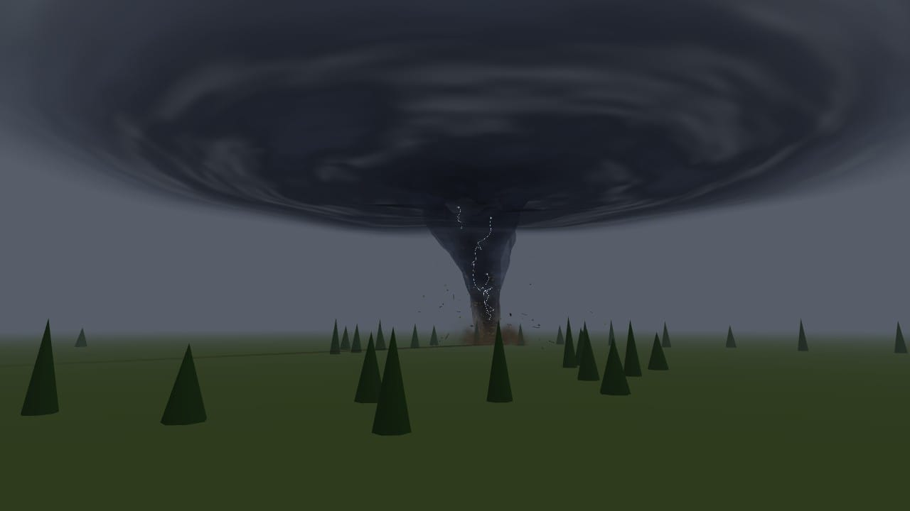
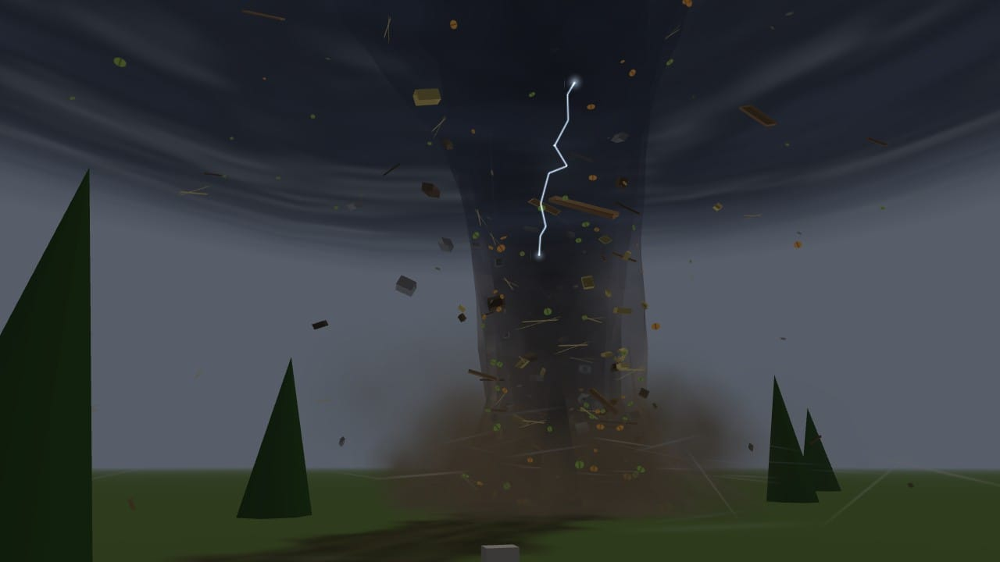

- **It looks like a real tornado**: a dark, solid funnel with a huge rotating storm cloud on top, a thick wall of dust at its foot, lightning running through it, and planks, branches, rocks and straw flung in every direction. It tears up the ground where it passes.
- **It pulls harder**: from **45 m** away, faster the closer you get.
- **It throws you much further**: **35–60 m**, high into the air. You land knocked down for a moment.
- **It hits harder**: each throw takes about **22 %** of your maximum health, and one tornado can take up to **55 %**.
- **It can kill**: at full health you'll survive it, but if you're already hurt, it can finish you off.
- It throws **more lightning** around it, aimed at the people nearby.
- Monsters get thrown too. Towns are still safe.

---

## October 6: No more stuck black screens

*October 6, 2026*

**If your browser's graphics hiccup, the game now switches to a safer graphics mode by itself, and if the browser itself stops showing 3D, it tells you exactly how to fix it. Plus a new Graphics mode option.**

## The game fixes itself when graphics hiccup

Sometimes a browser's graphics crash, for example when your PC runs low on memory or other programs are using the graphics card heavily. Before, the game could stay **black** after that.

- If the graphics device stops responding, the game now **reloads straight back to where you were** in a safer graphics mode (**WebGL2**), with no login or character select.
- The game also **checks that its picture really reaches your screen**. If the 3D view stays black during the day, it switches to the safer mode by itself (once, so it never gets stuck reloading).

## When the browser itself stops showing 3D

If the browser stops showing 3D content altogether, no game can draw in it until its graphics restart. The game now **tells you what to do** instead of leaving you on a black screen:

- **Open the game in another browser**, such as Microsoft Edge, or
- in **Chrome**, press **Shift+Esc**, select **GPU Process** and click **End process**, then reload the game. Your other tabs stay open.

You can open this help anytime: **Esc → Screen black?**, or the **Screen black?** link on the login screen.

## New option: Graphics mode

**Options → Graphics → Graphics mode**: **Automatic** (the default), **WebGPU** or **WebGL2 (compatibility)**. If your PC often has graphics trouble, choose WebGL2. The change applies after a reload, and the game offers to reload for you.

---

## October 5 (evening): Storms, lightning, a tornado and a new Berserk

*October 5, 2026*

**Real lightning now strikes players, monsters and the world. Storms roll in a few times a day and change how monsters behave, a rare lightning tornado roams the fields, and Berserk got a fiery makeover.**

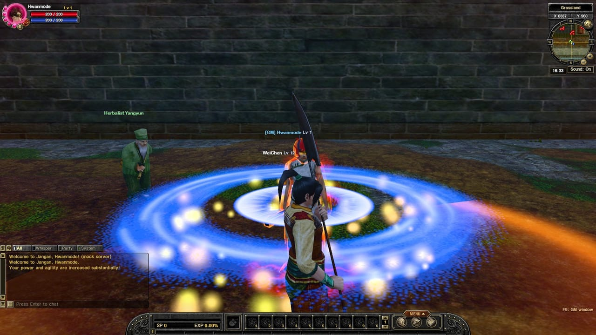

## Real lightning

During a thunderstorm, lightning now **really strikes**: players, monsters and the world itself.

- **You get a warning.** A **blue ring** appears on the ground and the air **crackles** 1 to 2 seconds before the bolt lands. Step out of the ring!
- **A hit hurts:** 22 to 38 % of your maximum HP and a **1.5-second stun**. If the rain has soaked you, it hits **20 % harder** (×1.2).
- **It never kills you from full health**, and **town is always safe**.
- Monsters get hit too, so a lucky bolt can help you out in a fight.
- The world reacts: trees catch fire, the ground is scorched and stone chips fly off the walls.

## Storms change the fields

About **three storms a day** roll over Jangan. Each one is announced **5 minutes ahead**, and a **weather icon** by the minimap lists everything the current weather does. Hover over it to read the effects.

- **Rain cuts monster sight:** monsters notice you later, so you can slip past them.
- **The undead grow stronger**: ghosts chase faster and hit harder in a storm.
- **Tigers and wolves hunt in packs**: a tiger on your trail calls its pack-mates.
- **Bandits pull back** to their camps and chase you less far.
- **Thunder panics the beasts:** a strike nearby can send them running.
- **Storm-charged monsters:** a monster that survives a lightning strike glows blue, crackles with arcs, hits harder and **drops better loot**. Worth hunting if you are brave.
- **Mud** slows your running outside town, strong **wind** makes arrows and long-range skills miss more often, and stormy nights come with a **dark fog**.
- Rain also changes the elements: **lightning** and **cold** skills hit harder, **fire** a little softer.

## The lightning tornado

A **rare** storm event: a lightning tornado touches down and wanders across the fields. Get too close and it **pulls you in** and **throws you out** again.

- It is **never lethal**: a wild ride, not a death.
- It **never enters town**.
- The game announces where it touched down, so you can run away... or run towards it.

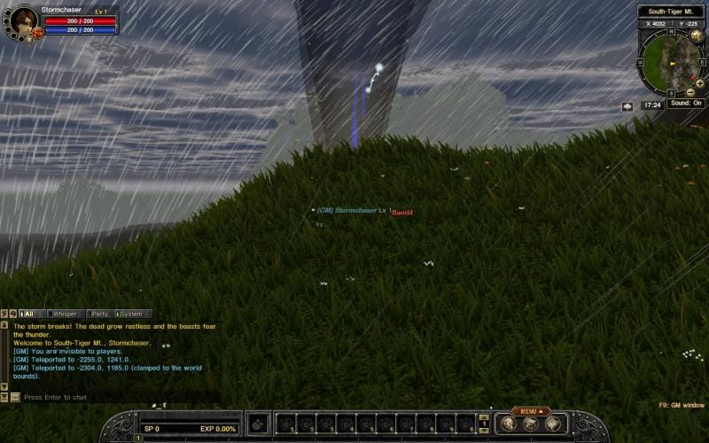
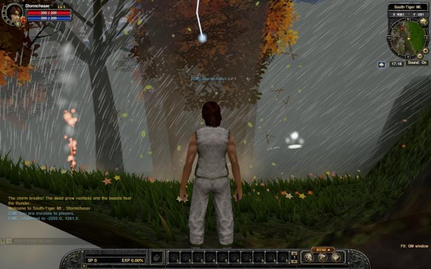
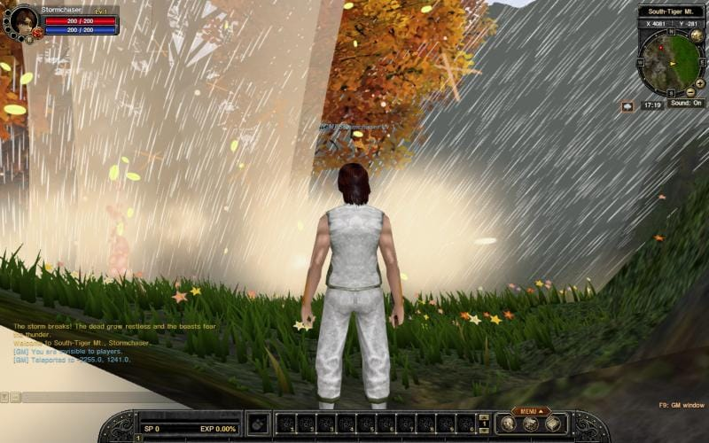

## A new Berserk

Berserk now looks as mighty as it feels:

- a **burning outline** around your character, **embers** rising and **glowing eyes**;
- **afterimages** trailing behind you when you move;
- a **shockwave** on the ground when Berserk starts;
- a **red, pulsing screen edge** while it lasts;
- and a **puff of steam** when it ends.

Too much for you? Turn the screen effects off in **Options → Interface → Berserk screen effects**. The look on your character stays.

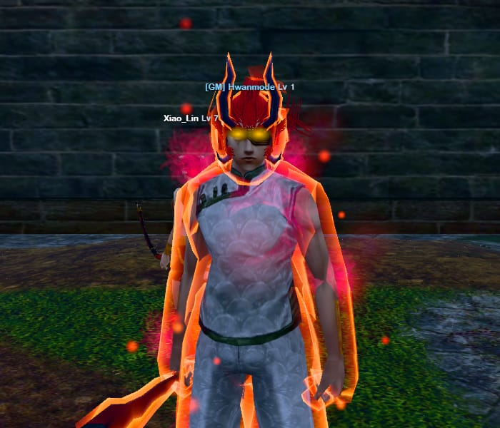
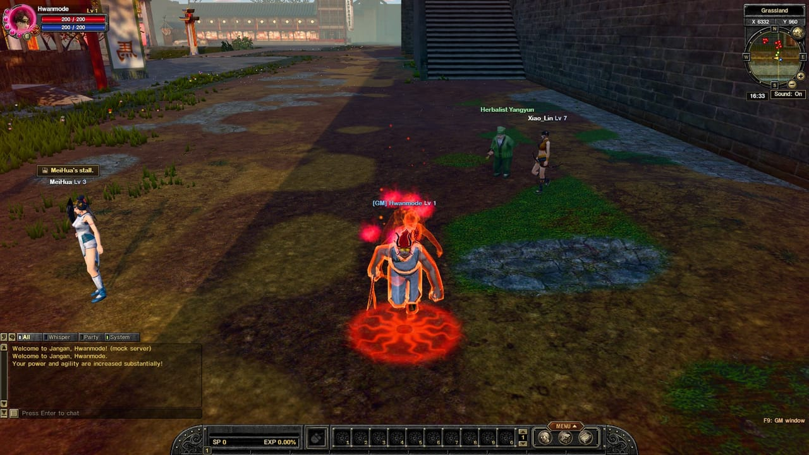

---

## October 5: Play the Boss, the black-screen fix and more

*October 5, 2026*

**Once a week one player becomes Tiger Girl while everyone else hunts her. The game now recovers by itself from a graphics reset, a memory leak is gone, and there is a long list of fixes and wishes from your feedback.**

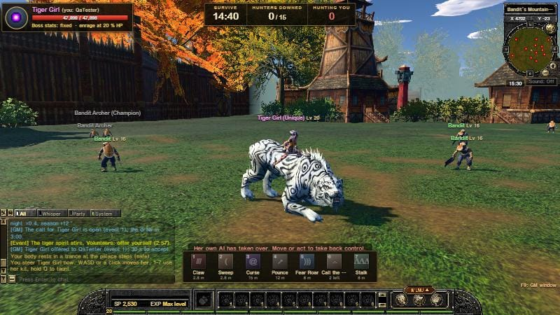

## Play the Boss: the Night of the Tiger

Once a week the **Night of the Tiger** begins. A call goes out to everyone online, players of **level 20 and up** volunteer, and one of them is drawn to *become* **Tiger Girl**. Everyone else hunts her. The more hunters really fight her, the stronger she grows, so a big crowd gets a real fight.

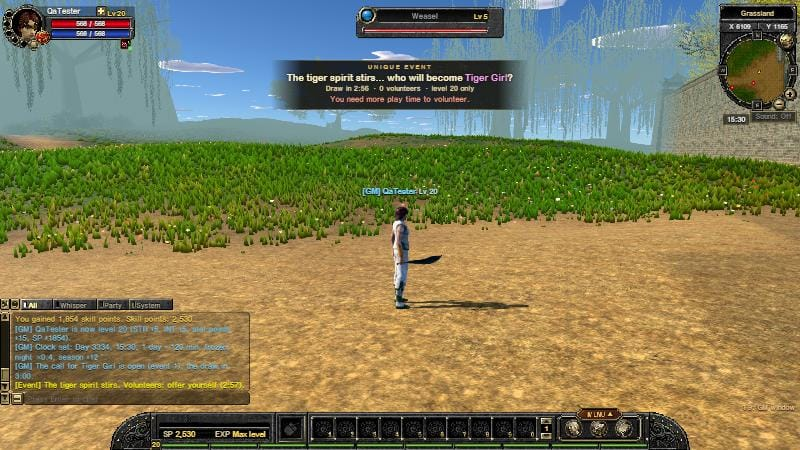
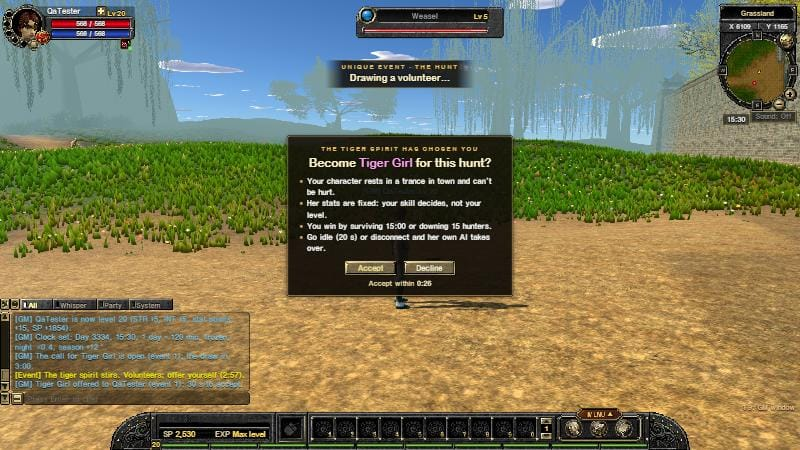

- While you play her, your own character rests safely in a trance in town.
- **Her kit:** Claw, Sweep, Curse, Pounce, Fear Roar, Call the Pack and Stalk, on keys **1 to 7**. Walk with **WASD** or a click, hold **Q** to taunt.
- **Boss HUD:** how long you must survive, how many hunters you have downed, and who is hunting you right now.
- Step away from the keyboard and her own AI takes over until you are back.

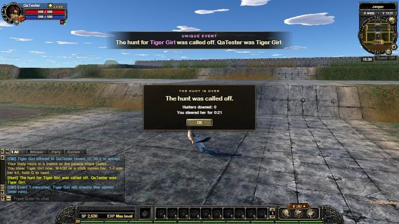

> Staff schedule the weekly night and can start a call by hand, so watch the chat and the notices for the next one.

## The black-screen fix

Some of you saw the game turn black and stay black. We found **two causes** and fixed both:

- **Graphics card resets.** If your graphics card ever reset, the 3D view never came back. Now a short notice appears, the game reloads itself and puts you **straight back where you stood**: no login, no character select. If it happens a second time, the game switches to the safer WebGL2 renderer on its own.
- **A memory leak.** While grinding monsters the game grew by about 60 MB a minute, which could end in a black screen after a long session. It is gone: in a 12-minute test memory now stays flat (about 320 MB instead of climbing past 1 GB).

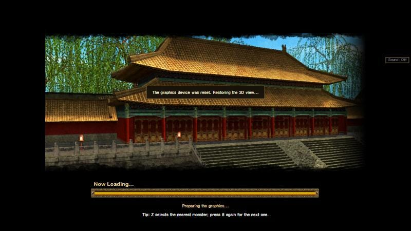
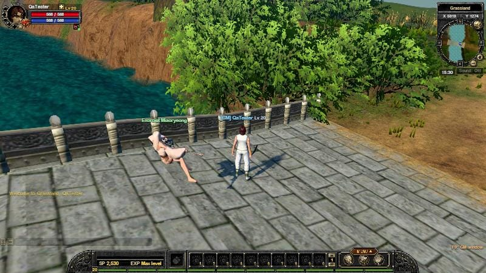

## Weapon glow +1 to +7

Enhanced weapons finally look the part. From **+1** a soft shimmer, then a glow and a pulse, up to the original's bursts of light at **+7**. Everyone around you sees it, and it stays light on Classic graphics.

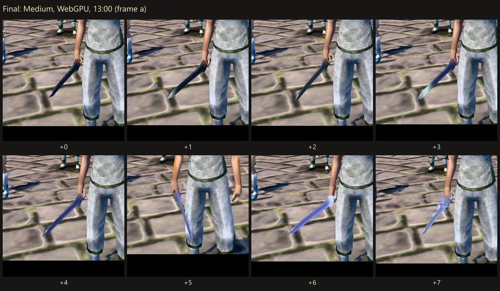

## Also in this update

- **Auto potion** (Options → Controls): drinks an HP potion below 50 % and an MP potion below 30 % (both adjustable), and can cure bad states with Universal Pills.
- **Mouse-wheel quick slot:** the "M" slot works. Drag a skill or a potion onto it, then click the mouse wheel in the world to use it. It is saved with your character.
- **Giant monsters** are twice the size, with a hit area that grows with them.
- **Champions attack on sight**, even those of passive monsters, like the original.
- **Party setup like the original:** the party type is asked when you invite, Invite / Settings / Leave are in the party window (P), and the original chat commands work.
- **Alchemy window fixes:** it no longer hides under the inventory, cancelling is clean, and there is a hint for worn items.
- **Garment rule:** Garment can't be mixed with Protector or Armor, as in the original. Sets you already wear are kept.
- **Sounds are back:** imbue hits, the accessory "ding", Berserk hits, quests, revival, rare drops and more.
- **Quiet town:** the crowd voices really stop when the town crowd is turned off.
- **Skills window** shows your skills the first time you open it.
- **"Can't walk here" switch** (Options → Controls) hides that warning and its sound.

## Fixes you can see

- **Classic (Low) graphics:** more than 400 trees and objects were invisible but still blocked your way. They are drawn again.
- **Character select:** the info box now sits beside your character, never over it.
- **Exorcist Miaoryeong** waits on the town end of the river bridge, no longer inside a bush.

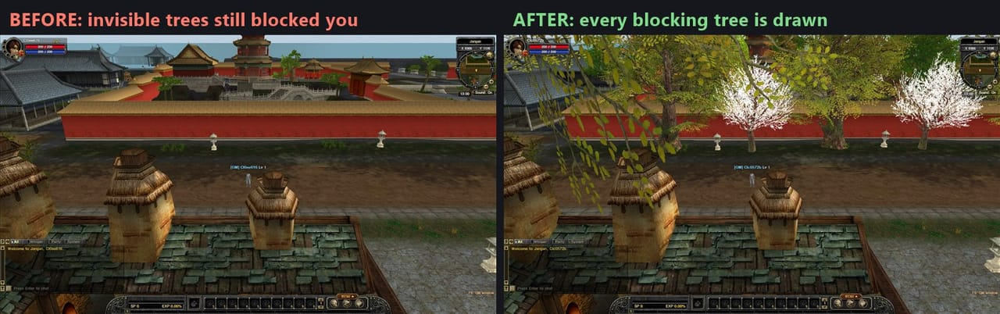
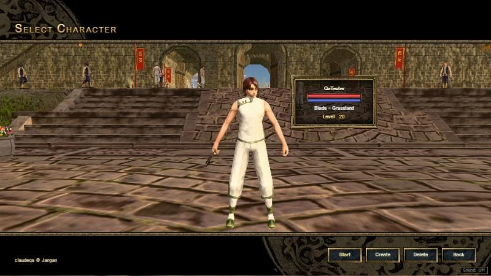
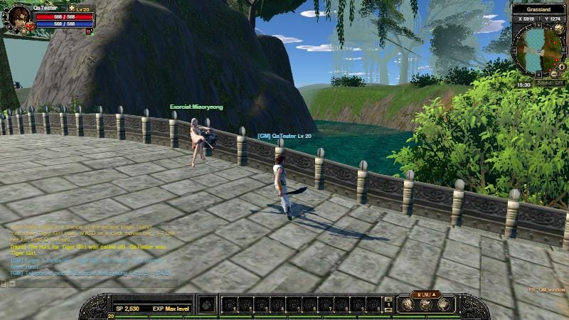

## For staff

A new web **admin panel** that works on phones too: accounts, items with their icons, drops, NPCs and spawns, quests, events (including the Night of the Tiger), settings, an audit log, and a switch to open or close registration.
