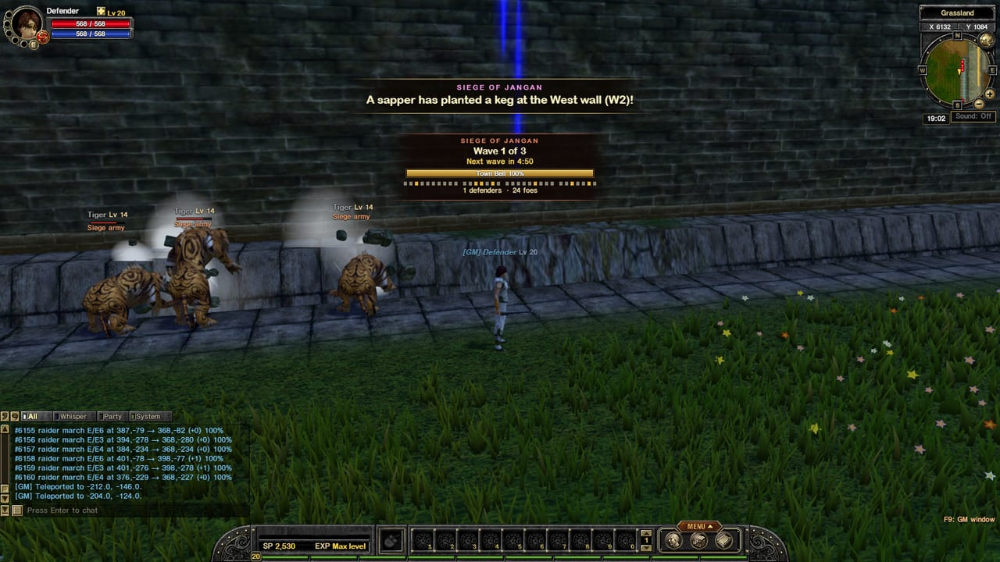
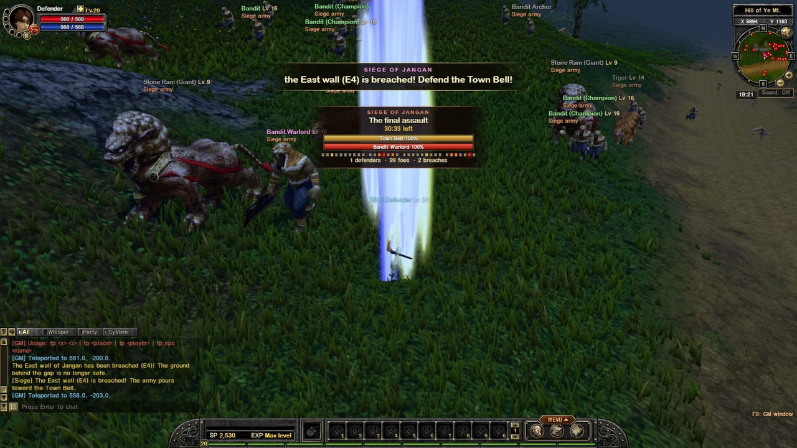
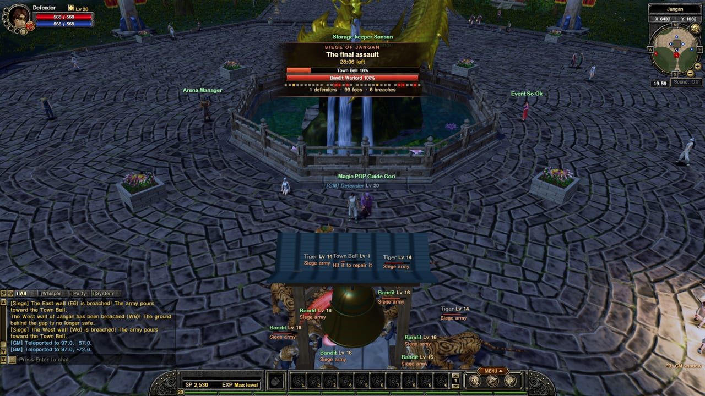
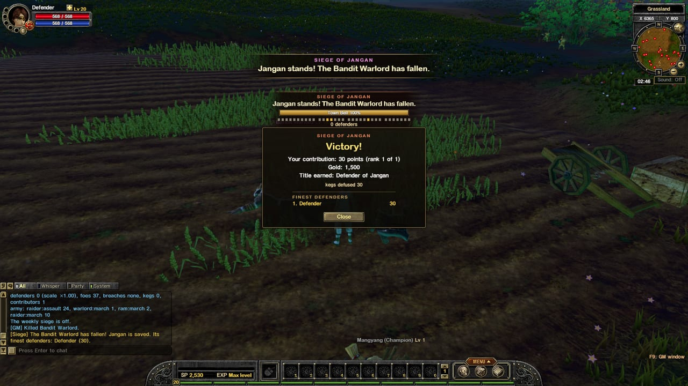
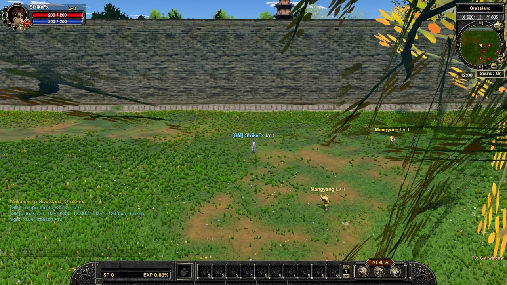

## The Siege of Jangan

A siege is announced to everyone a few minutes before it starts. Then the bandit army arrives in **three waves** from all sides of the town.

- **Raiders** attack the walls section by section.
- **Sappers** plant **powder kegs** against the wall. Get close and press the prompt to **defuse** one before it blows a hole in the wall!
- **Rams** batter the walls, and the gates are protected: monsters can't walk through them.
- When a wall is **breached**, the army pours through the gap toward the **Town Bell** in the plaza.

### The Town Bell

During a siege a great **Town Bell** stands in the plaza. If the army destroys it, the town falls. **Hit the bell yourself to repair it** while you fight off the attackers.

### Rewards

Everyone who helped defend the town and is online at the end gets **Siege Seals**, gold, and the title **"Defender of Jangan"**. If the town falls, nothing is lost: the broken walls just need rebuilding (and watch out for looters at the gaps).

The siege happens on a weekly schedule set by the staff, and only when enough players are online.

---

## No more giant leaves in your face

When the camera ended up inside a big tree, its leaves could cover the whole screen. Now leaves **fade out** when they're right in front of the camera or between the camera and your character, so you can always see yourself in a forest.

