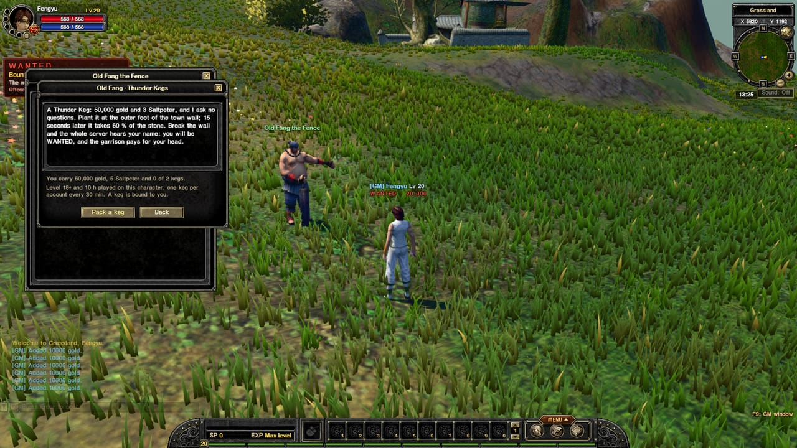
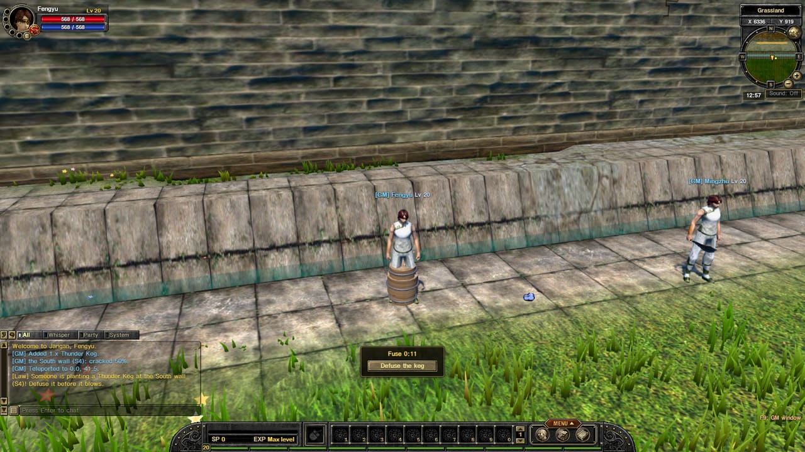
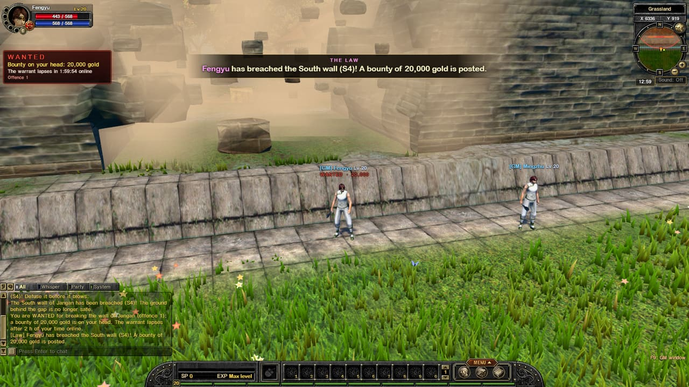
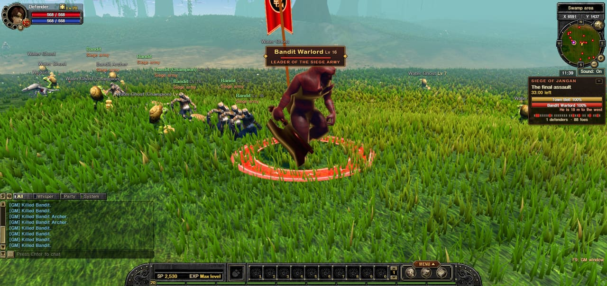
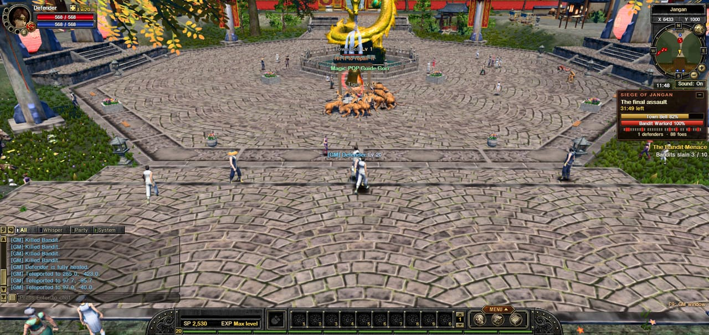

## Thunder Kegs

Old Fang the Fence, a shady trader in the fields west of town, sells **Thunder Kegs** for **50,000 gold and 3 Saltpeter** (Saltpeter drops from Bandits and siege monsters). No questions asked.

- Plant it at the **outer foot of the town wall**. It takes 5 seconds to plant, then the fuse burns for **15 seconds**.
- While you plant, the whole server is warned that *someone* is planting a keg at that wall. Anyone can run over and **defuse** it.
- If it blows, it tears a big chunk out of the wall section, and can open a **breach**.

Rules: level 18+ and 10 hours played, outside the town only, never at a gatehouse or corner tower, at most 2 kegs carried, one keg per account every 30 minutes. A keg is bound to you: it can't be traded, sold or dropped.

## WANTED

Break the wall and **everyone hears your name**. You become **WANTED**, with a red label over your head and a **bounty** posted by the garrison.

- The warrant lasts **2 hours of your time online**: logging out doesn't make it go away.
- Anyone else whose keg hit the same wall within 10 minutes is Wanted too, at half the bounty.
- Using a keg **during a siege** is **treason**: double the bounty, and you and your party, guild and other characters get **no siege rewards**.
- Offences stay on your **account's record** (alts share it), and each one is worse than the last. One level is forgiven for every 30 days of good behaviour.

> **Coming next:** **Hunters** who track the Wanted down and claim the bounty, and the **Garrison Stockade** where caught wall-breakers serve their time.

---

## The Bandit Warlord looks the part

The Warlord who leads the final assault is now **much bigger**, in **blackened crimson armour with gold edges**, with a **war banner** on his back, a **red ring** at his feet and a faint red beacon that shows where he is from the walls. A war horn sounds when the final assault begins, and the siege panel tells you where he is.

## The siege panel moved

The siege panel now sits **small under the minimap** instead of the middle of the screen, so you can see the Town Bell and the fighting. Press **−** to fold it to a single line.

