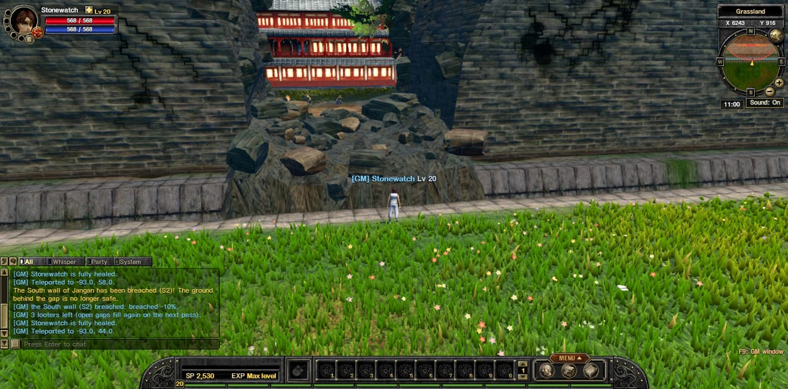
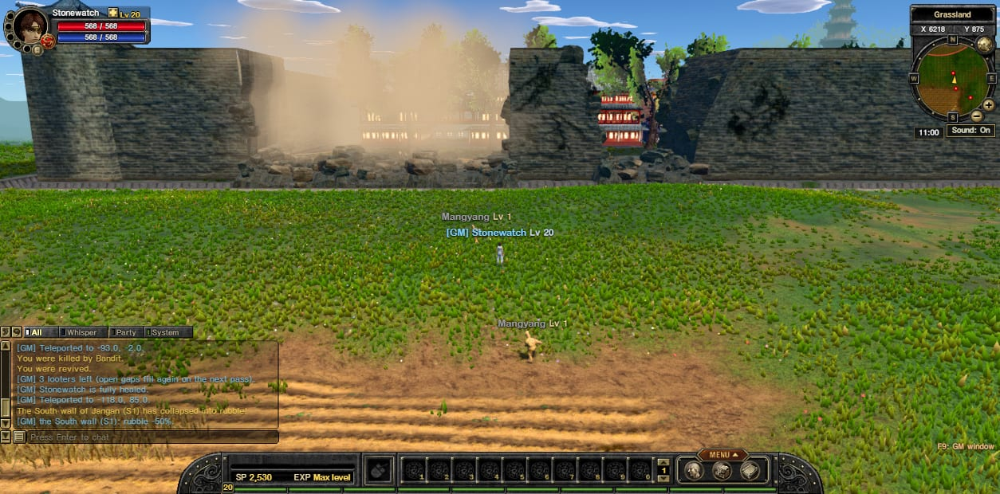
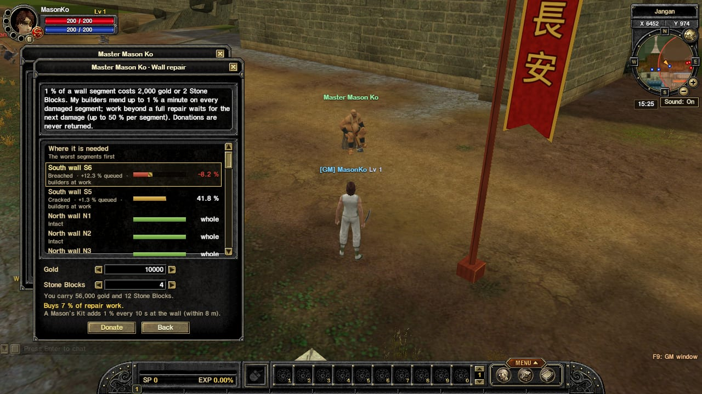
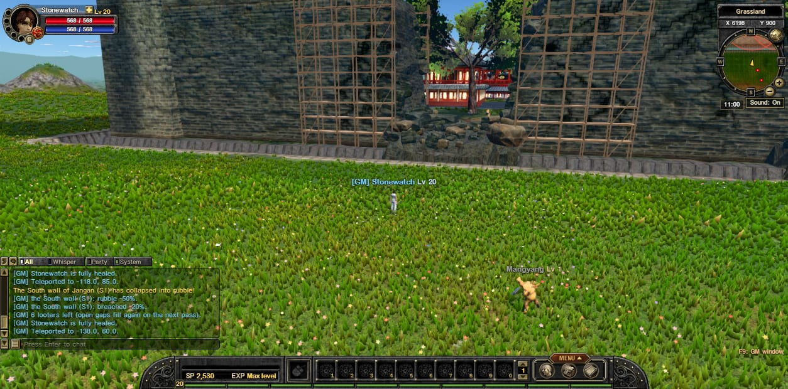

## The walls can break

Jangan's outer wall is now split into **33 sections**. Each one can be:

- **Cracked**: cracks run along the stone.
- **Breached**: a hole is torn in the wall. It's a **real gap**: you (and monsters!) can walk straight through, and the ground behind it is **no longer safe**.
- **Rubble**: the whole section collapses into a heap of stone.

When a section breaks, the whole server hears about it, the town bell rings, and the damage shows on your **minimap and world map** (red rings mark the ground that is no longer safe).

**Storms** can crack the walls, but lightning and tornadoes never bring a section down on their own.

> **Watch out:** bandit **looters** gather at every open breach until it is repaired.

## Rebuilding the walls

- **Master Mason Ko** stands on the main street north of the south gate. Donate **gold** or **Stone Blocks** to a section (or to wherever it's needed most) and his builders get to work.
- Buy a **Mason's Kit** from him to repair a wall yourself, standing right at the damaged section.
- **Stone Blocks** drop from Stone Ghosts, or buy them from Ko.
- Walls also mend slowly on their own.

## Coming next

The **Siege of Jangan** event: bandit armies march on the town, sappers blow holes in the wall, and the Warlord leads the last wave. After that: **Thunder Kegs**, **Wanted** wall-breakers, **Hunters** and the **jail**.
