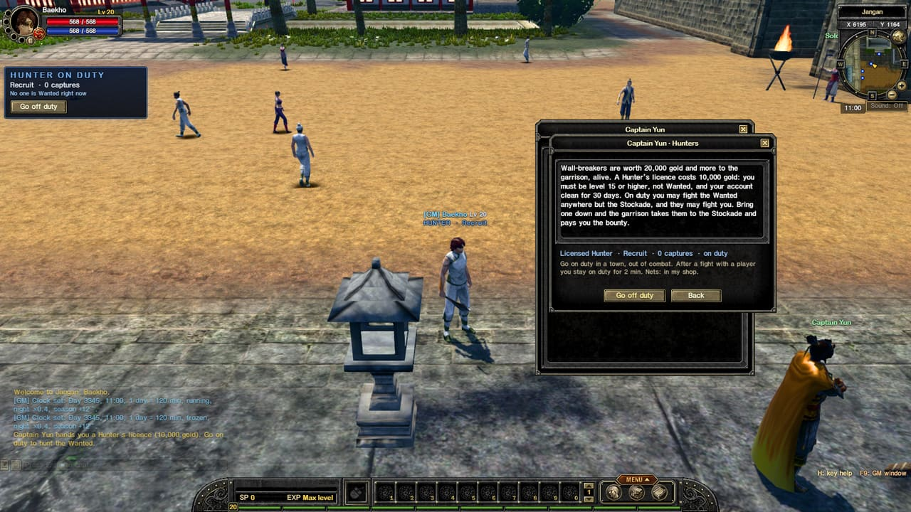
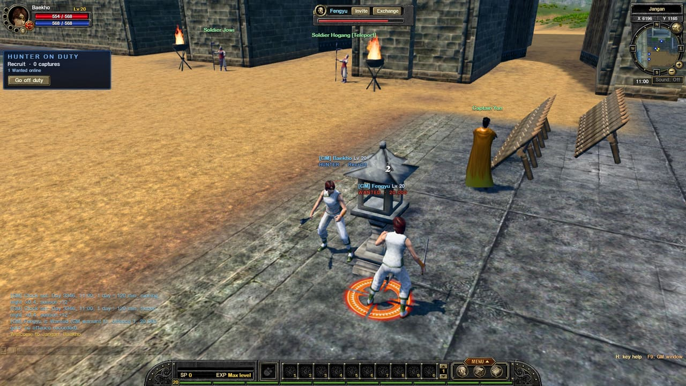
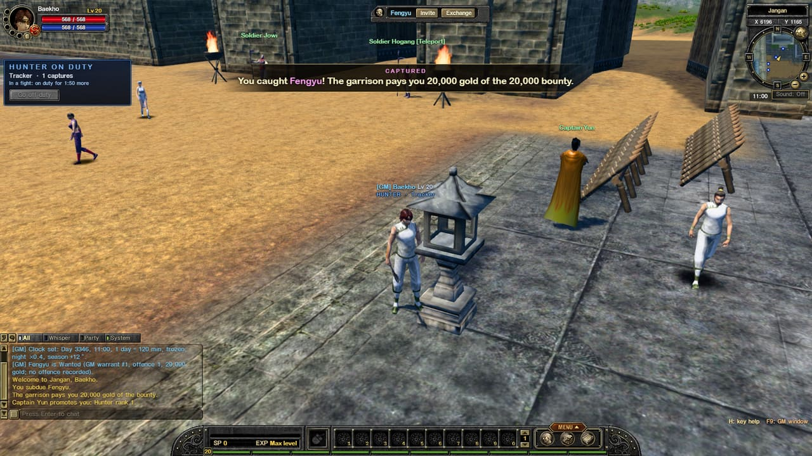
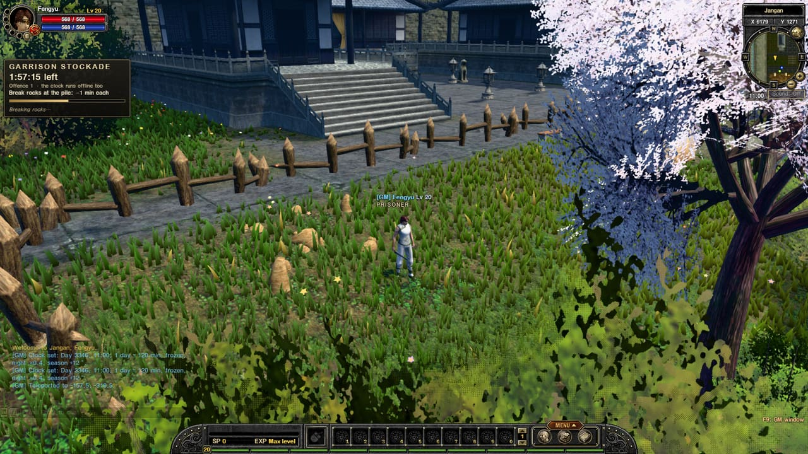

## Become a Bounty Hunter

**Captain Yun**, by the west gate, sells the **Bounty Hunter's licence**: level 15+, 10,000 gold, and a clean record (not Wanted, no offences in the last 30 days).

- Go **on duty** in town, out of combat. A blue **BOUNTY HUNTER** label shows over your head.
- On duty, you get a **ping** every minute showing roughly where the Wanted are, and they show on your minimap when you're close (120 m).
- Captain Yun also sells the **Bounty Hunter's Net**: throw it to stun a fleeing Wanted for 2 seconds.
- Start as a **Recruit** and climb five ranks (Tracker first) as your captures add up.

## The hunt

Only **on-duty Bounty Hunters** and **Wanted** players can fight each other, both ways, almost anywhere, even inside town. Nobody else can be attacked, so normal players are never caught in it. Damage between players is halved, and area skills never hit players.

A blow that would kill the Wanted leaves them at 1 HP instead: they're **bound**, and after 3 seconds they're **caught**. The garrison pays the bounty, split between the Bounty Hunters who did the damage. Logging out within 30 seconds of a Bounty Hunter's hit doesn't help: you're caught on the spot.

## The Garrison Stockade

Caught wall-breakers go straight to the **Garrison Stockade**: **2 hours** for a first offence, then **4, 8, 16 and 24 hours**. Treason (a keg during a siege) doubles it. The sentence keeps counting while you're logged off.

- You can't leave, fight or use skills. Chat, potions, sitting and emotes still work.
- **Break rocks** at the pile to take a minute off each time (up to a quarter of your sentence). Warden Bae keeps an eye on you.
- When you're released, you walk out of the gate free, and nobody can hunt you for 10 minutes.

## No farming the bounty

Getting a friend Wanted so another friend can collect the bounty does **not** work:

- Your party, guild, other characters and anyone on the same connection can never fight or claim you.
- Anyone who **traded**, used your **stall** or **partied** with you in the last week gets nothing. Neither does anyone who stood near the keg and didn't try to defuse it.
- The same Bounty Hunter catching the same player again within 7 days gets no gold and no credit.
- A bounty is always worth **less than the keg** that caused it, each catch of the same player within a week pays half, and Bounty Hunters have a daily bounty limit.
- Every capture still means **jail**, paid or not.
- Staff see every blocked reward and can take away a Bounty Hunter's licence.
