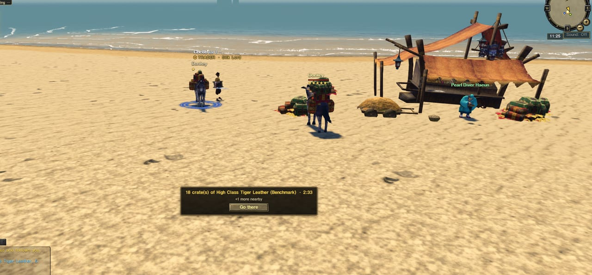
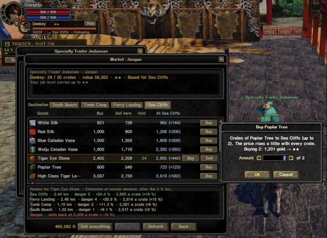
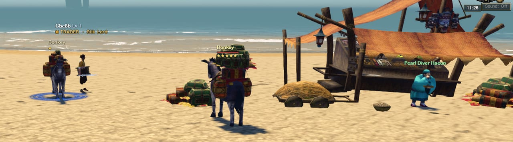
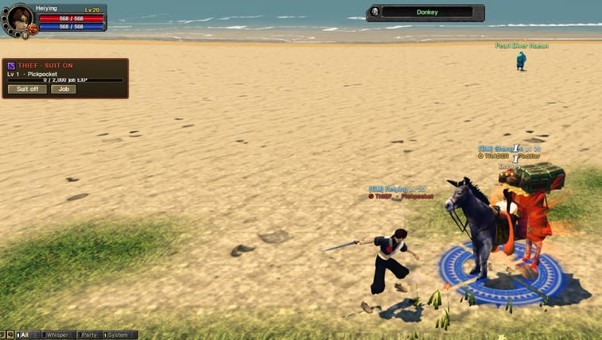
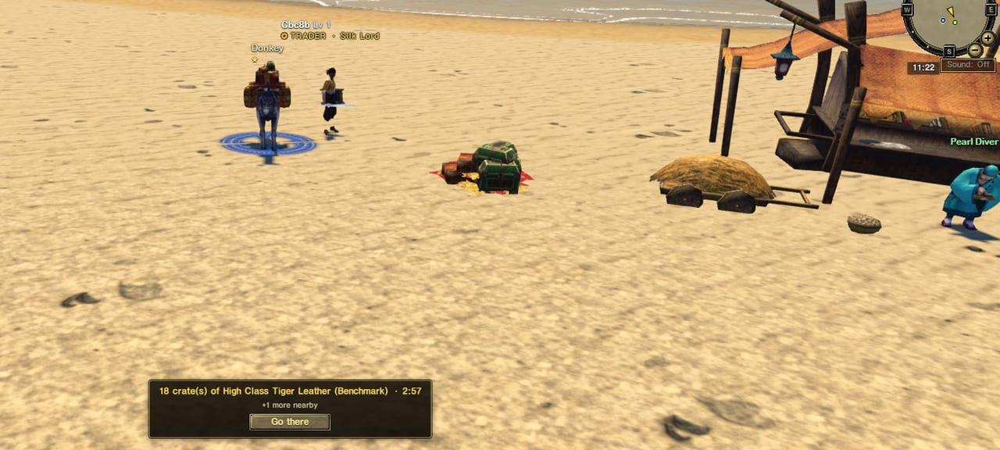
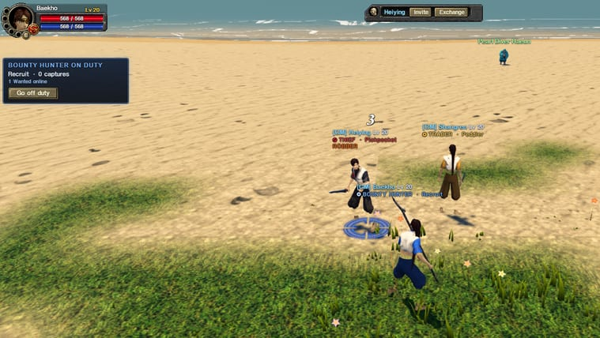
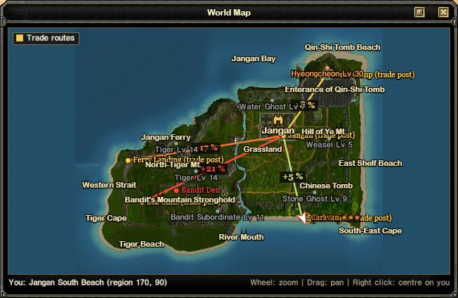

## Three jobs, two sides

From **level 15** you can take one of three jobs. Each has its own licence, its own seven job levels and its own suit:

- **Trader**: Specialty Trader **Jodaesan** in Jangan. Buy goods, load them on your pack animal and sell them where they are wanted.
- **Bounty Hunter**: **Captain Yun** by the west gate. The old Bounty Hunter licence is now a full job: escort caravans, catch robbers, return stolen goods.
- **Thief**: **Old Fang**. Rob the caravans on the roads and sell what you take at the Bandit Den.

Traders and Bounty Hunters are **the law**, Thieves are **the outlaws**, and all characters on one account stay on the same side. Put your **suit** on to go to work: only players in their suits can fight over the goods, and nobody else is ever pulled in. Towns, the trade posts and the Bandit Den are always safe. Your job, level and a coloured badge show under your name for everyone to see.

## Four trade posts on the island

Goods are bought cheap where they come from and sell for more the farther and the more dangerous the road. Jangan sells silk, celadon, tiger eye stones and leather. Four posts out on the island buy them and sell their own goods for the way back: **Pearl Diver Haeun** on South Beach, **Quartermaster Gong** at the Tomb Camp, **Ferry Master Wol** at the old Ferry Landing and **Salvager Mok** on the Sea Cliffs. Each post has its own market corner with a stall, a cart and crates of goods, so you can see it from the road.

Prices move with the market: every crate bought makes the next one dearer, every crate sold lowers the demand, and both slowly drift back. Every day one good is in the news and sells for 20 % more somewhere.

## Donkeys, horses and stars

Summon your **trade transport** at any trader: a **Donkey** (30 crates) first, then the **Horse**, the **Thoroughbred** and finally the armoured **Ironclad Trade Horse** (120 crates) as your Trader level rises. It walks behind you along your own path. You can **ride** it at its walking pace, tell it to **stay here** while you scout ahead, then call it back with **Follow**. All of these buttons are on its frame next to your portrait.

The value of the load sets its **stars**, from one to five. The stars show above the transport, and you can now see the load from a distance too: a one-star donkey carries a single small bundle, a five-star one is piled high with crates.

More stars mean more profit, more job EXP and more trouble: **bandit ambushes** wait on the road for rich caravans, monsters go for loaded animals, lightning strikes them and a tornado can scatter part of the load.

## Robbing a caravan

A Thief in his suit gets a rough **ping** of nearby caravans of three stars and more. Attack the transport (not the Trader). When it falls, **60 %** of its goods drop to the ground as crates and the rest is lost. Fallen goods now show as stacks of crates where they lie, as well as on the prompt and the minimap.

Whoever gets there first decides what happens to them. The Trader and his party can load them back on, a Bounty Hunter takes them to return to Captain Yun, and a Thief who picks them up becomes a **ROBBER**: every on-duty Bounty Hunter is told roughly where he is. Specialty Trader **Seopok** at the Bandit Den pays 60 % of the base price for stolen goods, no questions asked. Selling there closes the warrant.

## Catching robbers

Bounty Hunters can fight robbers anywhere except the Stockade and the Bandit Den's own ring. Bring one down and he is **caught**: the stolen goods are taken from him, the Bounty Hunters share a recovery reward, and the robber goes to the **Garrison Stockade** for 15 minutes, then 30, 60 and 120 for repeat robberies. Escorting a Trader in a party also gives Bounty Hunters a share of his job EXP.

## Balanced for real fights

We measured robbing and catching against characters of level 15, 20 and 25 with normal gear for their level, and tuned it so a fight lasts about a minute:

- A **Thief** of the same level takes a one- or two-star **Donkey** alone in about **45 to 90 seconds** at level 20 (faster with skills, slower with only basic attacks).
- The armoured **Ironclad Trade Horse** takes several minutes alone: rob it with **friends**.
- A **Bounty Hunter** brings down a robber of the same level in about **20 to 40 seconds**.
- Monsters and bandits hit transports exactly as before.

All of these numbers are live settings the team can adjust without a restart.

## The Trade routes map

Press **M**: the world map has a new **Trade routes** layer you can turn on and off. It shows the five trade points, the Bandit Den and the road from Jangan to each post, coloured by how dangerous it is and labelled with the profit per crate.

## Fixes

- Taking the suit off (for example when you were jailed) could leave a character wearing **no clothes at all** if they still had the starting outfit on. The starting outfit is now always drawn.

## No farming

The robbery rules follow the siege's: your party, guild, other characters, anyone on your connection and anyone you recently traded or partied with can't rob you or claim your goods. Robbing the same Trader again within a day pays half, then nothing, and robbing your own caravan always loses more than it pays. Staff see every blocked reward.
